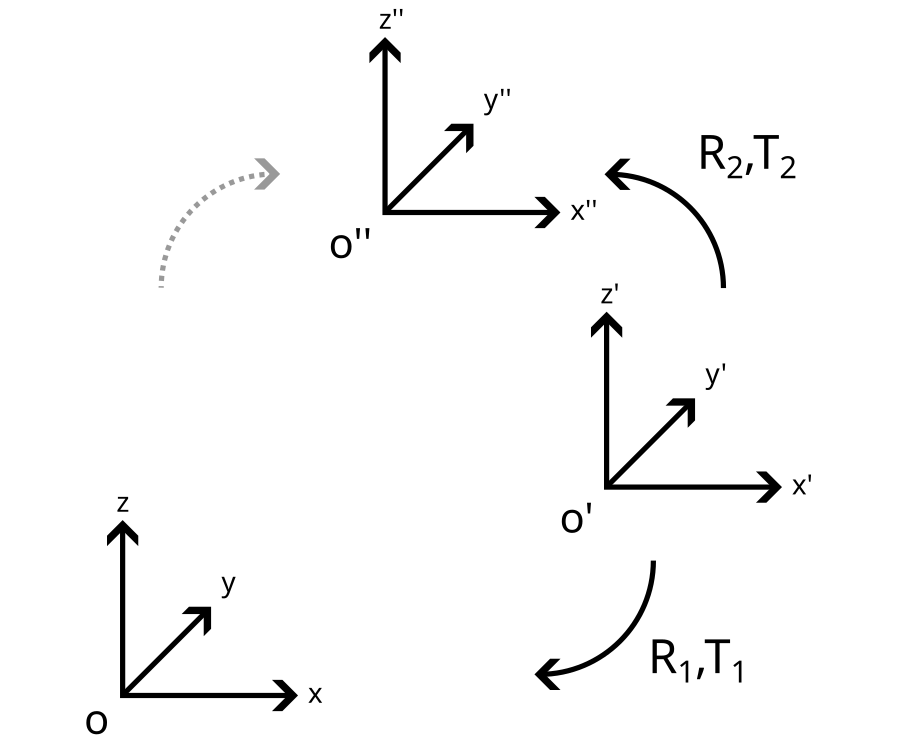

# evalReg

### A
```
git clone https://github.com/jpsm-at-deec/evalReg.git
python3 -m venv /path/to/new/virtual/environment
pip install -r requirements.txt
```

### B
```
source /path/to/new/virtual/environment/bin/activate
python test_transform_manager.py
```

### C


### D


### D
```
cd aux
python gen_aruco.py
```
