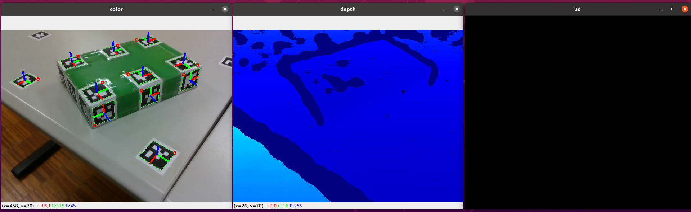

# evalReg


```
git clone https://github.com/jpsm-at-deec/evalReg.git
python3 -m venv /path/to/new/virtual/environment
pip install -r requirements.txt
```

```
source /path/to/new/virtual/environment/bin/activate
python test_transform_manager.py
```


